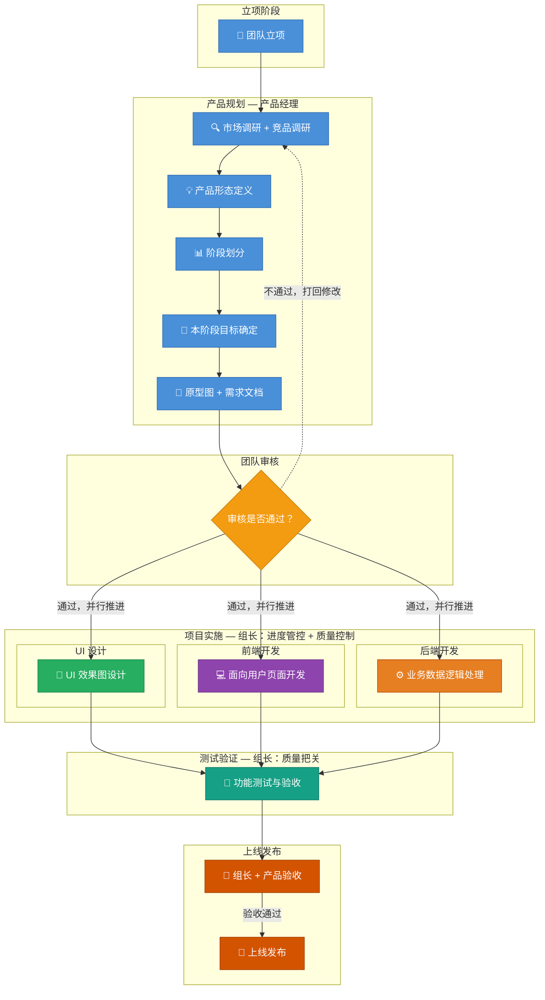

# 产品开发工作流

## 流程图

## 角色与职责

| 角色 | 核心职责 |
|------|---------|
| **团队** | 立项发起、审核把关产品方向和需求 |
| **产品经理** | 市场调研 + 竞品调研 → 产品形态定义 → 阶段划分 → 本阶段目标 → 原型图 + 需求文档 |
| **UI 设计** | 根据原型图设计最终 UI 效果图 |
| **前端开发** | 开发面向用户的交互页面 |
| **后端开发** | 处理业务逻辑与数据层 |
| **测试** | 功能测试、缺陷跟踪、验收验证 |
| **组长** | 全流程进度管控、各成员产出质量控制、上线最终审批 |

## 关键规则

1. **产品出原型 + 文档后必须团队审核**，通过方可进入实施
2. **审核不通过打回产品**，重新调研与修改
3. **UI / 前端 / 后端审核通过后并行启动**，互不阻塞
4. **所有开发完成后统一进入测试**，避免边开发边测的混乱
5. **上线前组长 + 产品联合验收**，确保交付质量
